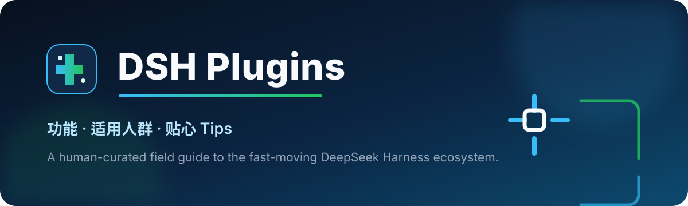

<p align="center">
  
</p>

<h1 align="center">DSH Plugins</h1>

<p align="center">
  <strong>别再一个个翻仓库了。好用的、热门的、有点意思的 DSH 插件，都在这里。</strong>
</p>

<p align="center">
  不只给你一串链接——每个插件都写清楚：<strong>能做什么、适合谁、怎么安装、有哪些好用 Tips，以及哪里容易踩坑。</strong>
</p>

<p align="center">
  <a href="https://awesome.re"></a>
  <a href="https://github.com/gityuanbao/DSH-Plugins/stargazers"></a>
  
  
  
  <a href="LICENSE"></a>
</p>

<p align="center">
  <a href="#-30-秒找到适合你的插件">30 秒选插件</a> ·
  <a href="#-直接抄作业4-套好用组合">直接抄作业</a> ·
  <a href="#-全部-16-个插件一张表看完">全部插件</a> ·
  <a href="#-热门精选逐个看">详细介绍</a> ·
  <a href="https://github.com/gityuanbao/DSH-Plugins/issues/new/choose">推荐新插件</a>
</p>

> DSH 的插件生态正在快速长大，但 GitHub Topic 里也混进了大量“只有标签、不能安装”的项目。这个仓库替你做第一轮筛选，再把真正影响选择的信息翻译成人话。

<p align="center">
  <strong>如果它帮你少翻了几个仓库、少踩了一个坑，点一下右上角 ⭐ Star。</strong><br>
  下次想给 DSH 加能力时，你还能很快找到这里。
</p>

## ✨ 这个合集能帮你什么

| 🔍 更快找到 | 🧭 更容易选对 | 💡 装完更好用 |
|---|---|---|
| 按工作台、视觉、多 Agent、安全、效率等场景整理 | 告诉你“适合谁”，也告诉你哪些插件功能重叠 | 每个项目都有一条实测思路或贴心 Tips |
| 热门项目与刚冒头的新锐项目分开 | 不拿 Star 数直接等同于质量 | 安装命令、版本要求和常见风险放在一起 |

## 🎯 30 秒找到适合你的插件

| 你现在最想做什么 | 直接看它 | 为什么 |
|---|---|---|
| 我刚开始玩 DSH，不知道装什么 | [dsh-market](#dsh-market) | 像逛应用商店一样找、装、更新插件 |
| 我想一步到位，把 Web UI 变成完整工作台 | [dsh-web-ui](#dsh-web-ui) | 看板、文件、Git、远程、视觉、主题基本全包 |
| 我只想要一个轻量 IDE，不想装全家桶 | [DSH-better-sidebar](#dsh-better-sidebar) | 文件、终端、Git、预览集中在右侧栏和底部面板 |
| 我想让纯文本 DeepSeek 看懂图片 | [ModLens](#modlens) | 粘贴图片就能拿到 OCR、布局和结构化证据 |
| 我是终端党，不想一直开浏览器 | [dsh-TUI](#dsh-tui) | Claude Code 风格的全屏终端体验 |
| 我想让 Agent 做长任务时少跑偏 | [Aegis](#aegis) | 给任务加上基线、验证、漂移检查和完成前复核 |
| 我想同时调度多个 Agent | [dsh-agent-teams](#dsh-agent-teams) | Captain、子 Agent、依赖任务和团队状态都有了 |
| 我想给危险命令和敏感信息加道提醒 | [dsh-guardian](#dsh-guardian) | 执行前识别风险，返回后尝试脱敏 |
| 我知道想要什么，但不知道插件名字 | [dsh-find-plugin](#dsh-find-plugin) | 直接让 Agent 帮你搜索 DSH 插件 |

## 🚀 直接抄作业：4 套好用组合

### ① 新手不折腾

`dsh-market` + `dsh-at-file` + `ModLens`

先补齐“找插件、引用文件、看图片”三个高频能力，几乎不改变你原来的工作方式。第一次玩 DSH，从这套开始最容易感受到插件的价值。

### ② Web 工作台

`dsh-web-ui` **或** `DSH-better-sidebar` + `dsh-at-file`

想一步到位选前者，想轻量可控选后者。两个重型工作台不要第一天一起装；先选一个，跑完真实任务再决定要不要叠加。

### ③ 复杂项目交付

`Aegis` + `dsh-agent-teams` + `brooks-lint`

用 Aegis 管过程、Agent Teams 做并行、brooks-lint 做最终审查。三者职责分开，比让每个插件都接管全流程更稳定。

### ④ 好看又好玩

`dsh-deep-whale` + `dsh-ads`

一个负责把工作台变成鲸鱼娘主题，一个负责把等待过程变成 2005 年门户网站。适合直播、演示和想让 DSH 更有个性的人。

## 🗺️ 全部 16 个插件，一张表看完

| 类别 | 插件 | 它最擅长什么 | 最适合谁 |
|---|---|---|---|
| 🖥️ 工作台 | [dsh-web-ui](#dsh-web-ui) | Web UI 全家桶 | 想一步到位的重度用户 |
| 🖥️ 工作台 | [DSH-better-sidebar](#dsh-better-sidebar) | 轻量 IDE 式侧边栏 | 想要文件、终端、Git 的开发者 |
| ⌨️ 终端 | [dsh-TUI](#dsh-tui) | 全屏终端交互 | 键盘党、终端党 |
| 👁️ 视觉 | [ModLens](#modlens) | OCR、布局与结构化图像证据 | 前端、截图排错、文档分析 |
| 👁️ 视觉 | [DSH Vision Toolkit](#dsh-vision-toolkit) | 裁剪、取色、坐标、像素级验证 | 设计 QA、GUI 自动化 |
| 🛍️ 视觉 | [WeShop for DSH](#weshop-for-dsh) | 电商图、试穿、背景与短视频 | 电商运营、视觉营销 |
| 🧠 工程 | [Aegis](#aegis) | 长任务方法论与验证 | 复杂修复、架构改造 |
| 🧠 工程 | [brooks-lint](#brooks-lint) | 代码、架构和技术债审查 | Reviewer、遗留系统团队 |
| 🧪 实验 | [dsh-anchored-standard](#dsh-anchored-standard) | 首轮提示词与工具锚定 | 做基准测试的高级用户 |
| 🤝 多 Agent | [dsh-agent-teams](#dsh-agent-teams) | Captain + 持久化子 Agent 团队 | 并行研究、代码审查、交付拆解 |
| ⚡ 效率 | [dsh-at-file](#dsh-at-file) | 输入 `@` 快速引用文件 | 经常指定文件和目录的人 |
| 🧩 发现 | [dsh-market](#dsh-market) | 图形化插件市场 | 新手、Web 用户 |
| 🧩 发现 | [dsh-find-plugin](#dsh-find-plugin) | 让 Agent 搜索插件 | 只知道需求、不知道名字的人 |
| 🛡️ 安全 | [dsh-guardian](#dsh-guardian) | 危险操作提醒与结果脱敏 | 常让 Agent 执行命令的人 |
| 🎨 主题 | [dsh-deep-whale](#dsh-deep-whale) | 鲸鱼娘主题皮肤 | 直播、展示、个性化用户 |
| 🎮 整活 | [dsh-ads](#dsh-ads) | 复古广告与推理中插播 | 社区演示、直播整活 |

> 表里的 Star、版本和安装方式核验于 **2026-08-15**。DSH 仍处于 Developer Preview，升级后请顺手回到原项目 README 看一眼最新说明。

## 🔥 热门精选，逐个看

<a id="dsh-web-ui"></a>
### 01 · [dsh-web-ui](https://github.com/zhu1090093659/dsh-web-ui) — DSH Web 的「全家桶」

`🔥 2.2k+ Stars` · `工作台` · `Apache-2.0`

一句话：把任务看板、Git 图谱、文件预览、移动端远程、SSH、图像理解、用量统计、宠物和皮肤中心全部塞进 DSH Web。

- **适合你，如果：** 你准备把 DSH 当主力工作台，希望一次补齐大部分界面能力。
- **💡 好用 Tips：** 只需要看板、SSH 或宠物时，优先安装对应子包；冲突更少，排错也更容易。
- **⚠️ 装前知道：** 全家桶权限面较大。第一次不要同时叠加另一个重型侧边栏框架；pnpm 11 用户还要看项目里的 hoisted 布局说明。

```sh
dsh plugin --profile web add @linxin666/dsh-web-ui-all
```

<a id="modlens"></a>
### 02 · [ModLens](https://github.com/liustack/modlens) — 给纯文本模型装上一双眼睛

`🔥 1.4k+ Stars` · `视觉 / OCR` · `MIT`

一句话：粘贴图片后，为 DeepSeek、GLM 等纯文本模型补上 OCR、布局、实体与关系等结构化证据。

- **适合你，如果：** 你要做前端还原、截图排错、文档 OCR 或看图问答，又不想更换主模型。
- **💡 好用 Tips：** 第一次先跑项目提供的健康检查，再选择名字里带 `(modlens vision)` 的路由；固定版本比追 `latest` 更容易复现。
- **⚠️ 装前知道：** 图片可能会发往你配置或复用的外部视觉服务，先确认实际调用哪家引擎、消耗哪份额度。

```sh
npx -y @deepseek-ai/dsh plugin --profile web add @liustack/modlens@3.16.6
```

<a id="brooks-lint"></a>
### 03 · [brooks-lint](https://github.com/hyhmrright/brooks-lint) — 让代码审查不再只靠感觉

`🔥 1.3k+ Stars` · `代码审查 / 架构` · `MIT`

一句话：把 12 本经典软件工程著作变成代码、架构、技术债和测试的检查清单，并给出有出处的修改建议。

- **适合你，如果：** 你负责 Code Review、维护遗留系统，或者希望 Agent 的建议更有工程依据。
- **💡 好用 Tips：** 先用 `/brooks-review` 或 `/brooks-health` 做只读体检，再决定要不要执行自动修复。
- **⚠️ 装前知道：** 它是 DSH 可发现的 Skill Pack，不是 Cordis Bundle；安装时要保留项目要求的扁平目录结构。

```sh
./scripts/install.sh dsh
```

<a id="dsh-anchored-standard"></a>
### 04 · [dsh-anchored-standard](https://github.com/xiaobright/dsh-anchored-standard) — 给首轮请求做一次「锚定」

`🔥 1.2k+ Stars` · `实验 Preset` · `未声明标准许可证`

一句话：首轮使用 Minimal 的提示词和真实工具 Schema，随后切回 Standard 的完整工具集。

- **适合你，如果：** 你在做模型基准测试，或研究首轮工具分布对 DeepSeek 表现的影响。
- **💡 好用 Tips：** 一定从空白会话开始，并按项目 Verify 清单检查前两次 `request/header`。
- **⚠️ 装前知道：** 特定 Project2 高分不能外推成通用性能提升；当前主要兼容证据针对 DSH `0.1.0-rc.5`。

```sh
cp -R preset ~/.dsh/.agent-presets/anchored-standard
```

<a id="dsh-tui"></a>
### 05 · [dsh-TUI](https://github.com/ccch1mneyyy/dsh-TUI) — 终端党会喜欢的 DSH

`🔥 1k+ Stars` · `终端工作台` · `MIT`

一句话：Claude Code 风格的全屏终端，带流式 Markdown、工具卡、`@` 文件引用、会话恢复、TPS、Skills、MCP 和子 Agent。

- **适合你，如果：** 你长期待在终端、偏好键盘操作，也想实时观察 Agent 状态。
- **💡 好用 Tips：** macOS Terminal 会抢走部分 `⌘` 快捷键，优先记住项目提供的 `Ctrl` 组合。
- **⚠️ 装前知道：** 要求 Node `^22.19` 或 `>=24`；它复用 DSH 当前 Profile 的安全边界，不另送一套沙箱。

```sh
npm install -g @deepseek-ai/dsh @deepseek-harness-tui/dsh-tui
```

<a id="aegis"></a>
### 06 · [Aegis](https://github.com/GanyuanRan/Aegis) — 给长任务加上工程纪律

`🔥 1k+ Stars` · `方法论 / 验证` · `MIT`

一句话：为长任务加入基线、证据验证、漂移检查、系统化调试和完成前复核。

- **适合你，如果：** 你要做架构改造、复杂修复或规格驱动开发，最怕 Agent “凭感觉完工”。
- **💡 好用 Tips：** 安装后用 `dsh --profile web --dump-config` 确认只出现一个 `aegis-method-pack`，再在新会话显式加载 `using-aegis`。
- **⚠️ 装前知道：** 不要同时把 Aegis 放进多个 Skills 目录，否则容易出现重复技能源。

```sh
dsh plugin --profile web add github:GanyuanRan/Aegis
```

<a id="dsh-better-sidebar"></a>
### 07 · [DSH-better-sidebar](https://github.com/omdsh-dev/DSH-better-sidebar) — 把 DSH 变成轻量 IDE

`🔥 890+ Stars` · `Web UI 工作台` · `MIT`

一句话：右侧栏 + 底部面板，集中提供文件树、编辑预览、浏览器、真实终端、Git 和后台任务。

- **适合你，如果：** 你想要 IDE 式体验，但不想安装一整套 UI 全家桶。
- **💡 好用 Tips：** 先只开文件、Git、任务三个核心 Tab，稳定后再逐个启用终端和浏览器。
- **⚠️ 装前知道：** 保持内容沙箱开启；Windows 终端能力可能受 `node-pty` 预编译产物影响。

```sh
npx -y --package @deepseek-ai/dsh dsh plugin --profile web add dsh-better-sidebar
```

<a id="dsh-deep-whale"></a>
### 08 · [dsh-deep-whale](https://github.com/Small-tailqwq/dsh-deep-whale) — 给工作台换上鲸鱼娘皮肤

`🔥 727+ Stars` · `主题 / 皮肤` · `CC BY-NC-SA 4.0`

一句话：为 DSH Web 提供深海女仆工坊风格的亮色与暗色鲸鱼娘主题。

- **适合你，如果：** 你想个性化工作台、直播展示，或者单纯觉得默认界面还不够有趣。
- **💡 好用 Tips：** 主题和功能插件分开装；遇到界面问题时，先单独禁用主题最容易定位。
- **⚠️ 装前知道：** 许可证禁止商业使用。商业视频、课程或品牌项目使用前要确认许可边界。

```sh
dsh plugin --profile web add ../dsh-deep-whale/maid-atelier
```

<a id="dsh-vision-toolkit"></a>
### 09 · [DSH Vision Toolkit](https://github.com/Anionex/dsh-vision-toolkit) — 不只是看图，还能量图

`🔥 382+ Stars` · `视觉工具箱` · `MIT`

一句话：10 个 Agent 视觉工具，覆盖长截图 OCR、裁剪、取色、坐标、几何验证、UI 还原和像素差异。

- **适合你，如果：** 你做前端、设计 QA、GUI 自动化，需要可测量、可复核的视觉证据。
- **💡 好用 Tips：** 本地裁剪、像素、颜色与 HTML 操作不需要视觉 API；远程工具再单独配 Credential。
- **⚠️ 装前知道：** 需要 Python 3.11+ 与 pnpm；它和 ModLens 有重叠，建议先选一个跑通真实任务。

```sh
dsh plugin --profile web add @anionex/dsh-vision-toolkit
```

<a id="dsh-ads"></a>
### 10 · [dsh-ads](https://github.com/Nagi-ovo/dsh-ads) — 把推理等待变成复古广告时间

`🔥 370+ Stars` · `娱乐插件` · `BSD-3-Clause`

一句话：把 DSH 变成 2005 年门户网站，加入侧栏广告、假游戏、弹窗和推理中插播。

- **适合你，如果：** 你要做社区演示、直播整活，或者想让等待时间更有戏剧效果。
- **💡 好用 Tips：** 广告位都能单独关闭；只保留“推理等待位”，通常最好笑也最不影响操作。
- **⚠️ 装前知道：** 这是纯娱乐插件，不要期待它提升模型性能。

```sh
dsh plugin --profile web add github:Nagi-ovo/dsh-ads
```

<a id="dsh-agent-teams"></a>
### 11 · [dsh-agent-teams](https://github.com/NanmiCoder/dsh-agent-teams) — 在一个会话里组建 Agent 小队

`🔥 286+ Stars` · `多 Agent` · `MIT`

一句话：让当前会话成为 Captain，创建可持续的子 Agent、依赖任务、直接消息和持久化团队状态。

- **适合你，如果：** 你要做多角度代码审查、研究或复杂交付拆解。
- **💡 好用 Tips：** 从“研究 / 实现 / 审查”三个角色起步，每个角色都写清交付物；Agent 越多不一定越快。
- **⚠️ 装前知道：** 同一工作区的团队状态不支持多个 DSH 进程同时写入；Captain 要复核任务状态。

```sh
dsh plugin --profile web add @nanmicoder/dsh-agent-teams
```

<a id="dsh-at-file"></a>
### 12 · [dsh-at-file](https://github.com/omdsh-dev/dsh-at-file) — 输入 `@` 就能引用文件

`🔥 163+ Stars` · `效率工具` · `MIT`

一句话：在输入框键入 `@` 搜索工作区文件和目录，把相对路径作为结构化引用交给 Agent。

- **适合你，如果：** 你经常要指定代码、文档、图片或整个目录，又不想手敲长路径。
- **💡 好用 Tips：** 用过滤规则排除大目录；同名文件多时，搜 `src/view` 这样的路径片段更准。
- **⚠️ 装前知道：** 它只附加路径，不自动读取文件内容；PDF、Office 能不能处理仍取决于当前工具。

```sh
dsh plugin --profile web add https://github.com/omdsh-dev/dsh-at-file/archive/refs/tags/v0.6.0.tar.gz
```

<a id="dsh-market"></a>
### 13 · [dsh-market](https://github.com/dsh-market/dsh-market) — DSH 的应用商店

`🔥 145+ Stars` · `插件市场` · `许可证待确认`

一句话：在 DSH 设置里浏览、搜索、排序、安装、更新和卸载社区插件与主题。

- **适合你，如果：** 你不想反复复制命令，希望用图形界面管理插件。
- **💡 好用 Tips：** 把它当“发现与安装器”，别当安全认证；安装前仍要看来源、版本和所需权限。
- **⚠️ 装前知道：** 第三方代码仍以本机权限运行，精选目录不能代替源码审查。

```sh
dsh plugin --profile web add dshmarket
```

## 🌱 新锐观察

这些项目很新，热度和兼容性还在形成中。我们收录它们，是因为能力有意思、安装路径可复现，而不是把它们包装成成熟项目。

<a id="dsh-find-plugin"></a>
### 14 · [dsh-find-plugin](https://github.com/awesome-dsh-plugin/dsh-find-plugin) — 让 Agent 帮你找插件

`🌱 20+ Stars` · `插件发现` · `MIT`

一句话：直接搜索 `dsh-plugin` Topic，按 Star 重排，并返回描述、仓库链接与安装命令。

- **适合你，如果：** 你知道想增加什么能力，但不知道插件叫什么。
- **💡 好用 Tips：** 问“找能在微信里审批 DSH 请求的插件”，比只搜“通知”有效；顺便让 Agent 给出权限面和最近更新时间。
- **⚠️ 装前知道：** Topic 有标签污染，排在前面不代表它真是原生插件，更不代表安全。

```sh
dsh plugin --profile web add dsh-find-plugin
```

<a id="weshop-for-dsh"></a>
### 15 · [WeShop for DSH](https://github.com/weshopai/weshop-dsh-plugin) — 给电商视觉做一张 AI 画布

`🌱 6+ Stars` · `电商视觉工作台` · `MIT`

一句话：把商品图片、虚拟试穿、背景替换、批量编辑和短视频生成放进与对话同步的无限画布。

- **适合你，如果：** 你做电商运营、商品摄影或视觉营销，需要批量产出创意变体。
- **💡 好用 Tips：** 先用低价值素材跑通 API Key、画布保存和导出，再导入正式商品资产。
- **⚠️ 装前知道：** 依赖 WeShop API 与额度；敏感产品图和客户数据要先核对服务条款。

```sh
npx weshop-dsh-plugin setup
```

<a id="dsh-guardian"></a>
### 16 · [dsh-guardian](https://github.com/lonelymoon87/dsh-guardian) — 给工具执行加一道提醒

`🌱 1+ Stars` · `安全策略` · `MIT`

一句话：工具执行前识别危险 Shell、SQL 与文件写入，结果返回后脱敏常见凭证，并提供只读安全审查工作流。

- **适合你，如果：** 你经常让 Agent 执行命令、读取日志，或在共享开发机上使用 DSH。
- **💡 好用 Tips：** 先用 `standard` 观察误报，再考虑 `strict`；优先安装固定 Release。
- **⚠️ 装前知道：** 它是策略层，不是进程沙箱、权限系统或 DLP，不能替代系统级隔离。

```sh
dsh plugin --profile web add github:lonelymoon87/dsh-guardian#v0.1.2
```

## 🧰 新手安装不翻车

别一口气装十个。最稳的方式只有四步：

1. **一次只装一个**，记住装到了哪个 Profile。
2. **确认配置真的生效**，不要只看安装命令有没有报错。
3. **跑一个真实任务**，确认它确实解决了你的问题。
4. **再装下一个**；出问题时先移除最后安装的插件。

```sh
# 看看插件是否进入目标 Profile
dsh plugin --profile web list --depth 0

# 检查最终组合配置
dsh --profile web --dump-config

# 完全重启长期运行的 Web Profile
dsh web
```

<details>
<summary><strong>🔐 安装第三方插件前，花 30 秒看一下</strong></summary>

DSH 插件会以你的本机权限运行，可能读取文件、使用凭证或访问网络。进入本合集不等于通过安全审计。

- 优先安装固定版本或固定提交，不要在关键环境盲追 `latest`。
- 第一次试装尽量使用不含生产密钥的环境。
- 带远程连接、终端、文件写入能力的插件，要重点看权限面。
- `curl | bash` 很方便，但最好先打开脚本看一遍再执行。
- 启动失败时先记录报错和 Profile 变更，不要直接删除整个 `~/.dsh`。

</details>

## 🧭 这个合集为什么值得收藏

这不是 `dsh-plugin` Topic 的自动镜像，也不是按 Star 排完就结束。

- **真的能接入 DSH**：必须有清晰的安装命令或接入说明。
- **告诉你为什么值得看**：每个条目都解释它带来的实际收益，而不是复制仓库简介。
- **热门和新锐分开**：新项目可以被看见，但不会被包装成已经成熟。
- **功能重叠会提醒**：例如 ModLens 与 Vision Toolkit、两个重型 Web 工作台，不会假装它们全都应该一起装。
- **风险不藏起来**：许可证、外部服务、版本要求和权限面会明确写出来。
- **数据可复用**：完整结构化目录在 [data/plugins.json](data/plugins.json)，来源在 [docs/SOURCES.md](docs/SOURCES.md)。

更详细的筛选规则见 [收录与核验方法](docs/METHODOLOGY.md)。Star 是核验日的 GitHub API 快照，只代表关注度，不代表质量或安全。

## 🙌 一起把它变成最大的 DSH 插件指南

发现漏掉的宝藏插件、安装命令过期，或者你有更好用的组合？欢迎：

- [提交一个插件](https://github.com/gityuanbao/DSH-Plugins/issues/new/choose)
- [发起 Pull Request](CONTRIBUTING.md)
- 在 Issue 里分享你的真实使用体验和避坑 Tips

### 给被收录的插件作者

欢迎把下面的徽章放进你的项目 README，让更多用户发现整个 DSH 生态：

[](https://github.com/gityuanbao/DSH-Plugins)

```md
[](https://github.com/gityuanbao/DSH-Plugins)
```

---

<p align="center">
  <strong>DSH 插件还会越来越多，这个列表也会继续长大。</strong><br>
  如果你希望下次还能找到它，点一下右上角 ⭐ Star；也欢迎把链接分享给正在玩 DeepSeek Harness 的朋友。
</p>

<p align="center">
  Made for the DeepSeek Harness community · Human-curated, not auto-generated
</p>

<sub>本项目与 DeepSeek 无隶属或背书关系。各插件版权、商标和责任归各自作者；收录不代表推荐其用于生产环境。</sub>
